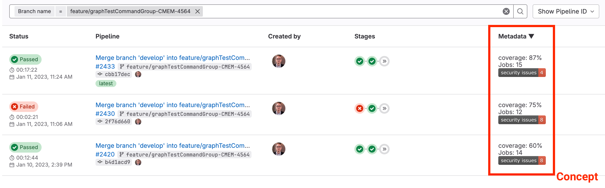

# cimd

Collect and share metadata of CI/CD processes.

**cimd** is an acronym for **C**ontinuous **I**ntegration **M**eta **D**ata.

[](https://github.com/seebi/cimd/actions) [](https://pypi.org/project/cimd) [](https://pypi.org/project/cimd)
[![poetry][poetry-shield]][poetry-link] [![ruff][ruff-shield]][ruff-link] [![mypy][mypy-shield]][mypy-link] [![copier][copier-shield]][copier] 

<!-- vim-markdown-toc GitLab -->

* [Motivation](#motivation)
* [Status of this Project](#status-of-this-project)
* [Development](#development)
* [Data: `__metadata__.json`](#data-__metadata__json)
    * [Location](#location)
    * [Content](#content)
    * [Schema](#schema)
* [Frontend](#frontend)
* [Command Line Tool](#command-line-tool)

<!-- vim-markdown-toc -->

## Motivation

In order to get a fast overview on recent pipelines in a gitlab repository, this projects tries to provide the backend and frontend capabilities to extend the gitlab pipeline list with a custom metadata column.

Gitlab already has some metadata mechanisms (e.g. [coverage patterns](https://docs.gitlab.com/ee/ci/testing/code_coverage.html#test-coverage-examples)) but they are limited to a specific scope.

The basic idea of this project is to use a pipeline JSON metadata artifact on a well-known position (fixed job ID with fixed artifact path), which can be easily fetched and parsed by a custom user script in order to extend the pipeline list with metadata item representations.



## Status of this Project

- concept ready
- basic frontend user script ready (see js folder)
- ~~backend tool to collect data ready~~


## Development

- Run [task](https://taskfile.dev/) to see all major development tasks.
- Use [pre-commit](https://pre-commit.com/) to avoid errors before commit.
- This repository was created with [this copier template](https://github.com/eccenca/cmem-plugin-template).


## Data: `__metadata__.json`

This section describes the details about JSON data artifact document which holds your custom pipeline metadata.

### Location

In your pipeline description, create an additional job with the ID `__metadata__` which creates an artifact with the path `__metadata__.json`.

A `.gitlab-ci.yml`, which provides an empty data artifact is available [here](https://gitlab.com/seebi/gitlab-pipeline-metadata/-/blob/main/.gitlab-ci.yml?ref_type=eb2b4498).

### Content

The content of the `__metadata__.json` is a simple structure to describe separate metadata items.
The minimal version of a metadata item has simply a `value` key.

``` json
{
    "items": {
        "coverage": {
            "value": "87%"
        }
    }
}
```

In addition to that, the following optional keys can be used for a metadata item: `label`, `description`, `image`, `link` and `comment`.

``` json
{
    "items": {
        "coverage": {
            "value": "87%",
            "comment": "'value' is the only mandatory key of a metadata item."
        },
        "jobs": {
            "value": "15",
            "label": "Jobs",
            "description": "Number of overall jobs executed in the pipeline.",
            "comment": "'label' and 'description' can be used to enhance the UI."
        },
        "security_issues": {
            "value": "4",
            "image": "https://img.shields.io/badge/security%20issues-4-red",
            "link": "https://example.org/security_issues",
            "comment": "We all love badges - and clickable badges are even better."
        }
    }
}
```

Hereinafter you will find some comments on the optional field:

- `label` - A human readable label for a metadata item. If present, it should be used by the frontend instead of the item identifier.
- `description` - A description of the metadata item. If present, can be used as on-hover text in the frontend for an item.
- `image` - An optional link to an image representation of the item (e.g. a shields.io image). If present, it should be used instead of the ID/Label/Value representation of the item. Images should be rendered with max-height/width.
- `link` - If present, the metadata item representation is click-able.
- `comment` - will be ignored by the frontend, for debugging only.

### Schema

The proposed JSON structure is formalized as a [JSON Schema](https://json-schema.org/), which available here: [schema/schema.json](schema/schema.json) (or vizualized in [json-schema-viewer.vercel.app](https://json-schema-viewer.vercel.app/view?url=https%3A%2F%2Fgitlab.com%2Fseebi%2Fgitlab-pipeline-metadata%2F-%2Fraw%2Fmain%2Fschema%2Fschema.json&description_is_markdown=on&expand_buttons=on&show_breadcrumbs=on&show_toc=on&with_footer=on&template_name=js#items_pattern1))


## Frontend

The frontend part of this project fetches the JSON metadata artifact for all pipelines on the screen, processes them, and integrates the values in the table.

Ideas beyond the initial prototype:

- header allows to select specific items
- header allows for sorting
- header allows for filtering

## Command Line Tool

The backend part of this project runs in the metadata CI job and provides and easy way to produce a `__metadata__.json` with the items wanted.

``` shell
$ pipx install cimd
$ ciwd add coverage "85%" --label "Code Coverage"
ADD: coverage (85%)

$ cimd list
Key       Value    Additional Fields
--------  -------  --------------------
coverage  85%      label: Code Coverage
```


[poetry-link]: https://python-poetry.org/
[poetry-shield]: https://img.shields.io/endpoint?url=https://python-poetry.org/badge/v0.json
[ruff-link]: https://docs.astral.sh/ruff/
[ruff-shield]: https://img.shields.io/endpoint?url=https://raw.githubusercontent.com/astral-sh/ruff/main/assets/badge/v2.json&label=Code%20Style
[mypy-link]: https://mypy-lang.org/
[mypy-shield]: https://www.mypy-lang.org/static/mypy_badge.svg
[copier]: https://copier.readthedocs.io/
[copier-shield]: https://img.shields.io/endpoint?url=https://raw.githubusercontent.com/copier-org/copier/master/img/badge/badge-grayscale-inverted-border-purple.json
