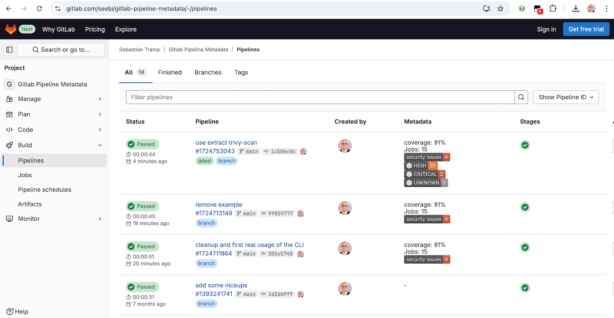

<!-- markdownlint-disable MD012 MD013 MD024 MD033 -->
<!-- https://github.com/DavidAnson/markdownlint?tab=readme-ov-file#configuration -->
<h1 align="center">
  
</h1>

<p align="center">
  <strong>cimd</strong> is about collecting and sharing structured metadata of CI/CD processes.
</p>

<p align="center">
<strong>cimd</strong> is an acronym for <strong>C</strong>ontinuous <strong>I</strong>ntegration <strong>M</strong>eta <strong>D</strong>ata.
</p>

<p align="center">
  <a href="#motivation">Motivation</a>
  ·
  <a href="#features">Features</a>
  ·
  <a href="#installation">Installation</a>
  ·
  <a href="#development">Development</a>
  ·
  <a href="#specification">Specification</a>

</p>

## Badges

![Code and License][code-and-license] [![license-shield]][license-link] [![ruff][ruff-shield]][ruff-link] [![mypy][mypy-shield]][mypy-link]<br />
![Github Stats][github-stats] [![Github Issues][issues-shield]][issues-link] [![Github Action][action-shield]][action-link] [![Github Commits][commit-activity-shield]][commit-activity-link]<br />
![User Script][userscript] [![Greasy Fork Entry][greasyfork-shield]][cimd-greasyfork] [![Sources][js-source-shield]][userscript-github]<br />
![Python Package][python-package] [![pypi-version][pypi-version-shield]][pypi-link] [![pypi-version][pypi-downloads-shield]][pypi-link] [![python-versions][python-versions-shield]][pypi-link]<br />
![Docker Image:][docker-image] [![docker][docker-pulls-shield]][docker-link] [![docker][docker-size-shield]][docker-link] [![Base Image][base-image-shield]][base-image-link]<br />
![Used Tools:][used-tools] [![poetry][poetry-shield]][poetry-link] [![copier][copier-shield]][copier] [![task][task-shield]][task-link]<br />

## Motivation

To provide a fast overview of recent pipelines in a GitLab-managed repository, this project provides the backend and frontend capabilities to extend the GitLab pipeline list with a custom metadata column.

GitLab already has some metadata mechanisms (e.g. [coverage patterns](https://docs.gitlab.com/ee/ci/testing/code_coverage.html#test-coverage-examples)), but they are limited to a specific scope.

The basic idea of this project is to prepare and provide metadata artifacts on a well-known position, which can be easily fetched and parsed by a custom user script to extend the pipeline list with metadata item representations.


## Features

**cimd** contains of a command line tool (CLI) and a frontend user script.

### Frontend

The frontend is available as a single JavaScript file in the [js folder][userscript-github].
It is currently tested with Tampermonkey on Google Chrome only 🙈.
Once activated, it will extend the pipeline view of your ![cmid metadata enabled][cmid-metadata-enabled] GitLab project with a metadata column, showing the items (screenshot example below).



### Command Line Tool

The CLI is used to prepare and manipulate metadata items in a `__metadata__.json` document.

It has the following features:

- commands for basic CRUD operations:
  - `add` - add a metadata item
  - `delete` - delete metadata items
  - `get` - get data of a metadata item
  - `list` - list metadata items
- `extract` command group, which collects commands to extract metadata items from different sources:
  - `junit-xml` - extract metadata from JUnit XML output files
  - `pipeline-logs` - extract metadata from gitlab pipeline job logs
  - `trivy-scan` - extract metadata from Trivy scan JSON output files
- `extend` command group, which collects commands to extend metadata items in a special way:
  - `gitlab-link` - extend metadata items with a raw gitlab artifact link
  - `shields-badge` - extend metadata items with a [shields.io](https://shields.io) badge

## Installation

### Frontend

To install the **frontend userscript** with a user script manager such as Tampermonkey, you have the following options:

- Recommended: Go to the [greasyfork.org][cimd-greasyfork] entry of cimd and click the install button.
- Create a new script entry and copy/paste the content of the script from the [js folder][userscript-github].

After installation, feel free to go to the example pipeline list at [gitlab.com/seebi/gitlab-pipeline-metadata][example-pipeline-list].

### Command Line Tool

To install and use the **cimd command line interface**, you can use use all the ways the python ecosystem provides to you:

- Recommended ... via [pipx](https://pipx.pypa.io/stable/)

  ``` shell
  pipx install cimd
  ```

- The cool way ... via [uv](https://docs.astral.sh/uv/guides/tools/)

  ``` shell
  uvx cimd
  ```

- There is also a docker image ...

  ``` shell
  docker run -i -t --rm seebi/cimd
  ```

## Development

- Run [task](https://taskfile.dev/) to see all major development tasks.
- Use [pre-commit](https://pre-commit.com/) to avoid errors before commit.
- This repository was created with [this copier template](https://github.com/eccenca/cmem-plugin-template).


## Specification

This section describes the details about the JSON data artifact (`__metadata__.json`) which holds your pipeline metadata.

### Location

In your pipeline description, create a job which provides a JSON artifact adhering to the schema at the path `__metadata__.json`.

An example `.gitlab-ci.yml`, which creates some basic metadata items, is available at [gitlab.com/seebi/gitlab-pipeline-metadata][example-pipeline].

### Content

The content of the `__metadata__.json` is a simple structure to describe separate metadata items.

<details>
The minimal version of a metadata item has simply a `value` key.

``` json
{
    "items": {
        "coverage": {
            "value": "87%"
        }
    }
}
```

In addition to that, the following optional keys can be used for a metadata item: `label`, `description`, `image`, `link` and `comment`.

``` json
{
    "items": {
        "coverage": {
            "value": "87%",
            "comment": "'value' is the only mandatory key of a metadata item."
        },
        "jobs": {
            "value": "15",
            "label": "Jobs",
            "description": "Number of overall jobs executed in the pipeline.",
            "comment": "'label' and 'description' can be used to enhance the UI."
        },
        "security_issues": {
            "value": "4",
            "image": "https://img.shields.io/badge/security%20issues-4-red",
            "link": "https://example.org/security_issues",
            "comment": "We all love badges - and clickable badges are even better."
        }
    }
}
```

Hereinafter you will find some comments on the optional field:

- `label` - A human readable label for a metadata item. If present, it should be used by the frontend instead of the item identifier.
- `description` - A description of the metadata item. If present, can be used as on-hover text in the frontend for an item.
- `image` - An optional link to an image representation of the item (e.g. a shields.io image). If present, it should be used instead of the ID/Label/Value representation of the item. Images should be rendered with max-height/width.
- `link` - If present, the metadata item representation is click-able.
- `comment` - will be ignored by the frontend, for debugging only.

</details>

### Schema

The proposed JSON structure is formalized as a [JSON Schema](https://json-schema.org/) which is available at [schema/schema.json][schema-github] or can be visualized in the [json-schema-viewer@vercel.app][schema-app].


[poetry-link]: https://python-poetry.org/
[poetry-shield]: https://img.shields.io/endpoint?url=https://python-poetry.org/badge/v0.json
[ruff-link]: https://docs.astral.sh/ruff/
[ruff-shield]: https://img.shields.io/endpoint?url=https://raw.githubusercontent.com/astral-sh/ruff/main/assets/badge/v2.json&label=Code%20Style
[mypy-link]: https://mypy-lang.org/
[mypy-shield]: https://www.mypy-lang.org/static/mypy_badge.svg
[copier]: https://copier.readthedocs.io/
[copier-shield]: https://img.shields.io/endpoint?url=https://raw.githubusercontent.com/copier-org/copier/master/img/badge/badge-grayscale-inverted-border-purple.json
[docker-link]: https://hub.docker.com/r/seebi/cimd
[docker-pulls-shield]: https://img.shields.io/docker/pulls/seebi/cimd?logo=docker&logoColor=white
[docker-size-shield]: https://img.shields.io/docker/image-size/seebi/cimd/latest?logo=docker&logoColor=white
[action-link]: https://github.com/seebi/cimd/actions
[action-shield]: https://github.com/seebi/cimd/actions/workflows/check.yml/badge.svg
[commit-activity-shield]: https://img.shields.io/github/commit-activity/y/seebi/cimd?logo=github&logoColor=white
[commit-activity-link]: https://github.com/seebi/cimd/pulse/monthly
[license-link]: https://github.com/seebi/cimd?tab=Apache-2.0-1-ov-file
[license-shield]: https://img.shields.io/pypi/l/cimd?logo=apache&logoColor=white
[pypi-link]: https://pypi.org/project/cimd
[pypi-version-shield]: https://img.shields.io/pypi/v/cimd?logo=pypi&logoColor=white
[pypi-downloads-shield]: https://img.shields.io/pypi/dm/cimd?logo=pypi&logoColor=white
[python-versions-shield]: https://img.shields.io/pypi/pyversions/cimd?logo=python&logoColor=white
[issues-shield]: https://img.shields.io/github/issues/seebi/cimd?logo=github&logoColor=white
[issues-link]: https://github.com/seebi/cimd/issues
[base-image-shield]: https://img.shields.io/badge/FROM-ubi9--minimal-orange?logo=redhat
[base-image-link]: https://hub.docker.com/r/redhat/ubi9-minimal/tags
[task-shield]: https://img.shields.io/badge/Taskfile-Enabled-brightgreen?logo=task&logoColor=white
[task-link]: https://taskfile.dev/
[greasyfork-shield]: https://img.shields.io/badge/Greasy_Fork-Available-black?labelColor=darkred&logo=data:image/png;base64,iVBORw0KGgoAAAANSUhEUgAAABAAAAAQCAYAAAAf8/9hAAAABmJLR0QA/wD/AP+gvaeTAAAACXBIWXMAAAsTAAALEwEAmpwYAAAAB3RJTUUH3ggEBCQHM3fXsAAAAVdJREFUOMudkz2qwkAUhc/goBaGJBgUtBCZyj0ILkpwAW7Bws4yO3AHLiCtEFD8KVREkoiFxZzX5A2KGfN4F04zMN+ce+5c4LMUgDmANYBnrnV+plBSi+FwyHq9TgA2LQpvCiEiABwMBtzv95RSfoNEHy8DYBzHrNVqVEr9BWKcqNFoxF6vx3a7zc1mYyC73a4MogBg7vs+z+czO50OW60Wt9stK5UKp9Mpj8cjq9WqDTBHnjAdxzGQZrPJw+HA31oulzbAWgLoA0CWZVBKIY5jzGYzdLtdE9DlcrFNrY98zobqOA6TJKHW2jg4nU5sNBpFDp6mhVe5rsvVasUwDHm9Xqm15u12o+/7Hy0gD8KatOd5vN/v1FozTVN6nkchxFuI6hsAAIMg4OPxMJCXdtTbR7JJCMEgCJhlGUlyPB4XfumozInrupxMJpRSRtZlKoNYl+m/6/wDuWAjtPfsQuwAAAAASUVORK5CYII=
[js-source-shield]: https://img.shields.io/badge/GitHub-Source-blue?logo=Javascript

[code-and-license]: https://img.shields.io/badge/Code_and_License_%3E-gray
[github-stats]: https://img.shields.io/badge/Github_Stats_%3E%3E%3E%3E-gray
[userscript]: https://img.shields.io/badge/Frontend_Script_%3E%3E-gray
[python-package]: https://img.shields.io/badge/Python_Package_%3E%3E-gray
[docker-image]: https://img.shields.io/badge/Docker_Image_%3E%3E%3E-gray
[used-tools]: https://img.shields.io/badge/Used_Tools_%3E%3E%3E%3E%3E-gray

[userscript-github]: https://github.com/seebi/cimd/blob/main/js/

[schema-app]: https://json-schema-viewer.vercel.app/view?url=https%3A%2F%2Fgitlab.com%2Fseebi%2Fgitlab-pipeline-metadata%2F-%2Fraw%2Fmain%2Fschema%2Fschema.json&description_is_markdown=on&expand_buttons=on&show_breadcrumbs=on&show_toc=on&with_footer=on&template_name=js#items_pattern1
[schema-github]: https://github.com/seebi/cimd/blob/main/schema/schema.json
[example-pipeline]: https://gitlab.com/seebi/gitlab-pipeline-metadata/-/blob/main/.gitlab-ci.yml?ref_type=eb2b4498
[cimd-greasyfork]: https://greasyfork.org/en/scripts/530296-gitlab-pipeline-metadata-via-cimd

[cmid-metadata-enabled]: https://img.shields.io/badge/%7Bcimd%7D-metadata_enabled-gray?labelColor=orange
[example-pipeline-list]: https://gitlab.com/seebi/gitlab-pipeline-metadata/-/pipelines
